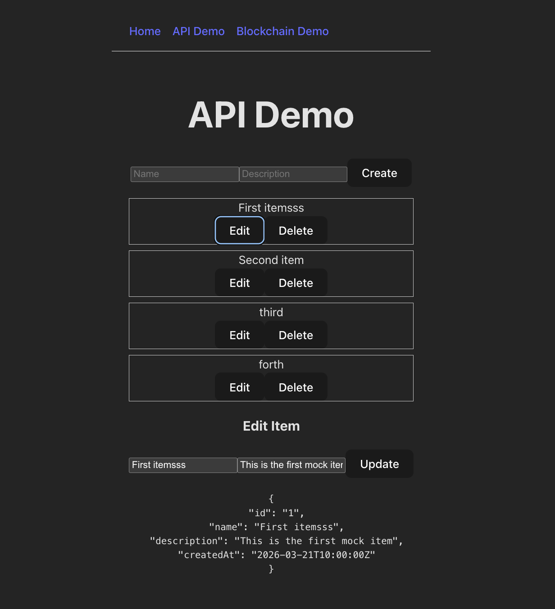
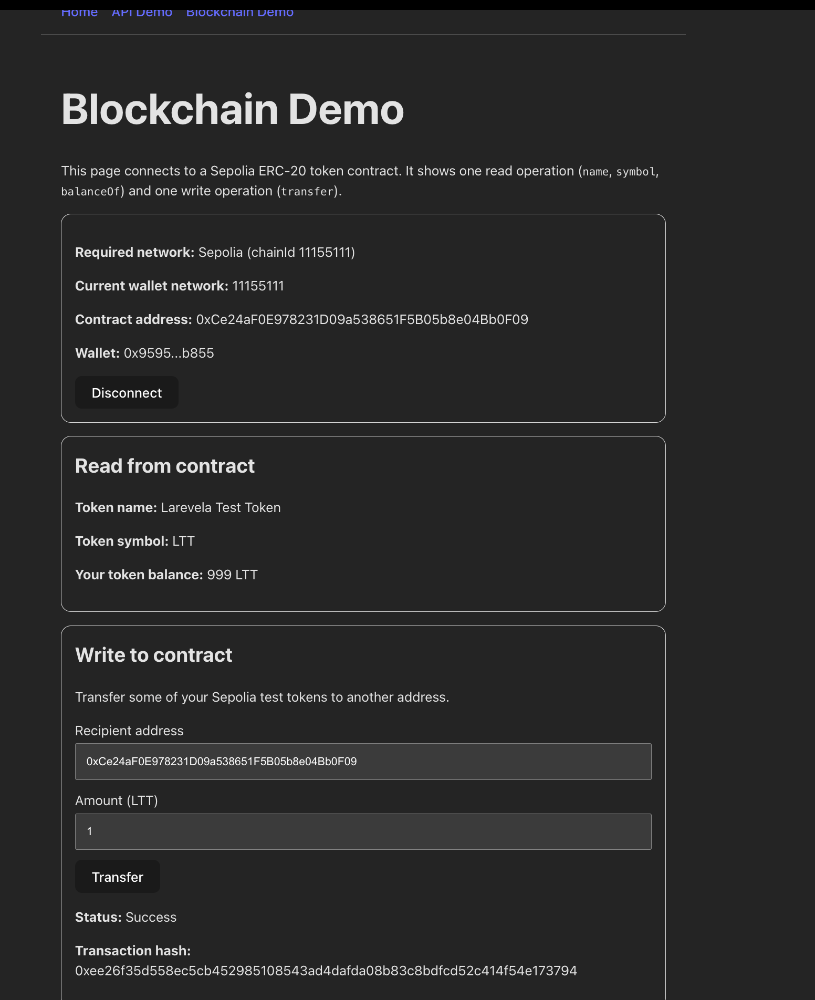

# Frontend Technical Test

This project includes:

- Part 1: REST API integration
- Part 2: Blockchain smart contract integration

---
# PART#1
## Run Frontend
From frontend file（larevelaTask/frontend）:

```bash
npm install
npm run dev
```
## Run mock API (json-server) (if need)

From project root（larevelaTask/）:

```bash
npx json-server@0.17.3 --watch db.json --routes routes.json --port 3000
```
---
## What I did

- Added a minimal **Swagger / OpenAPI spec** (`docs/api-spec.json`)
- Replaced the manual API client with an **OpenAPI-based solution using Orval**
- Added a custom Axios mutator to centralize API request configuration (base URL, auth headers)
  - `api/mutator/custom-instance.ts`
- Added a wrapper layer for API hooks:
  - `hooks/useApi.ts`
- Implemented full CRUD flow at frontend page:
  - list / create / update / delete items
  - `pages/ApiDemo.tsx`
- Added **local mock backend using json-server** for testing

---


## API Demo Screenshot



---
# PART#2
## What I did

- Integrated **Web3 wallet connection** using viem 
- Configured **Sepolia test network** , infura key, and a smart contract deployed 
  - `.env`
- Implemented reusable blockchain layer:
  - `blockchain/config.ts` (network + contract config)
  - `blockchain/contract.ts` (contract read/write helpers)
- Built a custom React hook:
  - `hooks/useWallet.ts` to manage wallet state and interactions
- Updated UI and Implemented contract interactions:
  - `pages/BlockchainDemo.tsx`
  - wallet connection status
  - token info display
    - `name()`
    - `symbol()`
    - `balanceOf(address)`
  - transfer form + feedback
    - `transfer(address, amount)`
- Added full transaction lifecycle handling:
  - pending → success → failed
  - transaction hash tracking
- Added reactive updates for:
  - account changes
  - network changes(detect wrong network)


## How to Test Blockchain

1. Open/install MetaMask
2. Switch network to Sepolia 
3. Connect wallet (click the "connect" button at page http://localhost:5173/blockchain-demo)
4. Check token info (Since I don't have your wallet address, so it will be 0 at your side; There is a screenshot for my wallet address attached below. Or you can send me your wallet address, so I can send some test token to you that you can test the transfer function in your side)
5. Get test ETH (https://sepolia-faucet.pk910.de/)
6. Send transfer transaction

---

## Blockchain Screenshot




